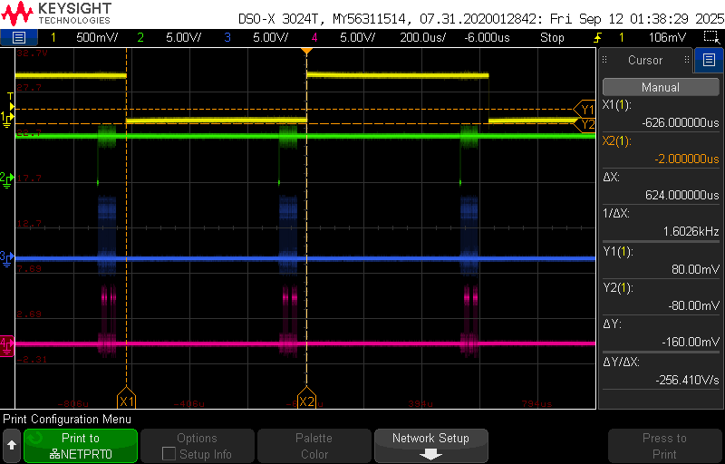
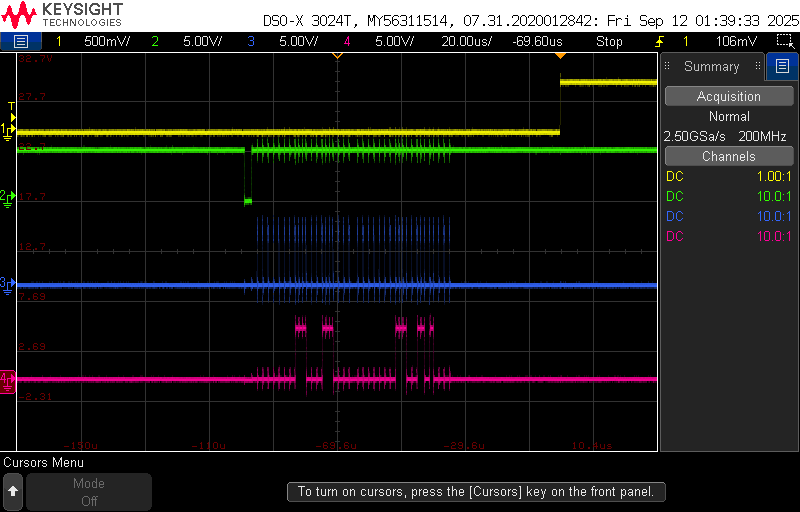

# Testing

Here are some waveforms from readout using the software as of 9/11/25.
Initialization is:

    >t 10000
    >g 7
    >p
    
Here is the complete cycle.  Scope channels are:

    1.  CONV
	2.  nDVALID
	3.  DCLK
	4.  DOUT
	
You can see that the digitization frequency is about 1.6kHz and that there is plenty of time to read out the 2x20 bits.

Here is a zoom on the readout portion.

